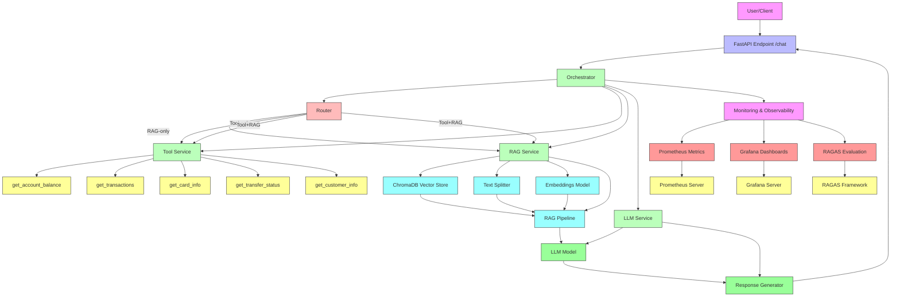

# AI Banking Assistant - Architecture

## Overview

This is a comprehensive AI Banking Assistant project that implements an intelligent chatbot system capable of handling customer banking inquiries through a single API endpoint `/chat`. The system intelligently routes questions between Retrieval-Augmented Generation (RAG) for general banking information and tools/APIs for specific customer data.

## Architecture Diagram

## Components Description

### 1. User/Client
- The external interface that sends requests to the banking assistant

### 2. FastAPI Endpoint (/chat)
- Main API endpoint for receiving chat requests
- Handles request validation and response formatting
- Routes requests to the orchestrator
- Exposes `/metrics` endpoint for Prometheus scraping

### 3. Orchestrator
- Core component that coordinates between different services
- Determines which data sources to use based on the query
- Integrates results from tools and RAG when needed

### 4. Router
- Analyzes user queries to determine appropriate data source
- Routes to:
  - RAG-only queries (general banking questions)
  - Tool-only queries (personal account information)
  - Tool + RAG queries (complex questions requiring both)

### 5. Tool Service
- Contains 5 banking API functions:
  - `get_account_balance(customer_id)`
  - `get_transactions(customer_id, start_date=None, end_date=None)`
  - `get_card_info(customer_id)`
  - `get_transfer_status(transfer_id)`
  - `get_customer_info(customer_id)`

### 6. RAG Service
- Retrieves relevant documents from knowledge base
- Uses ChromaDB vector store for document retrieval
- Processes text with embeddings and similarity search
- Provides context to LLM for answer generation

### 7. LLM Service
- Generates final responses based on retrieved information
- Uses appropriate prompts for different response types
- Ensures no invented information in responses

### 8. Monitoring & Observability
- **Prometheus**: Collects and stores time-series metrics
- **Grafana**: Visualizes metrics through dashboards and alerting
- **RAGAS**: Evaluates RAG quality (faithfulness, relevancy, precision)

## Data Flow

1. User sends request to `/chat` endpoint with `customer_id` and `message`
2. Orchestrator receives the request and passes it to Router
3. Router analyzes query and determines data source(s):
   - RAG-only: Query about general banking procedures → use only RAG
   - Tool-only: Query about personal account information → use only tools  
   - Tool + RAG: Complex query requiring both → use both
4. Based on routing decision:
   - If RAG-only: Query RAG service for relevant documents
   - If Tool-only: Query appropriate tool(s) with customer ID
   - If Tool + RAG: Query both tools and RAG, then combine results
5. Results are passed to LLM service for response generation
6. Final response is returned to user with source information
7. Metrics are collected and sent to Prometheus for monitoring
8. Grafana dashboards visualize the metrics and alert on issues
9. RAGAS evaluates quality of responses and RAG performance

## Monitoring Components

### Prometheus Metrics Collection
- Request counts by route type (RAG-only, Tool-only, Tool+RAG)
- Latency measurements for requests, tools, and RAG
- Tool call success/failure rates
- Cache hit/miss ratios
- Fact checking results
- RAG quality scores (faithfulness, relevancy, precision)

### Grafana Dashboards
1. **Banking Assistant Overview**: Request rates, error rates, latency by route type
2. **RAG Quality**: RAGAS evaluation scores and trends
3. **Tools & Errors**: Tool call statistics, error rates, cache performance

### RAGAS Evaluation
- Offline evaluation on test datasets
- Online sampling of production requests for quality assessment
- Metrics: faithfulness, answer relevancy, context precision, etc.